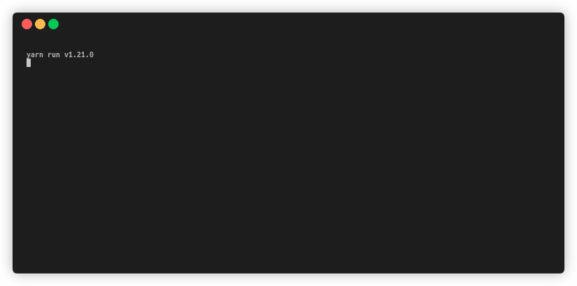

<div align="center">
  <h1>
   :credit_card: <i>node-sitef</i>
  </h1>

  <p>
  Portabilidade das DLLs do SiTef para aplicações JavaScript utilizando Node Addons
  </p>

  <a href="https://www.npmjs.com/package/node-sitef">
    
  </a>
  
  
  <a href="https://github.com/danielccunha/node-sitef/commits/master">
    
  </a>
  

</div>

## :computer: Projeto

A biblioteca consiste da portabilidade da DLL do [SiTef](https://www.softwareexpress.com.br/index.php?a=1590867134) para aplicações JavaScript. Ela foi desenvolvida em C++ portando para uma classe JavaScript utilizando [Node Addons](https://nodejs.org/api/addons.html).



## :wrench: Configuração

Adicione o pacote no seu projeto utilizando `yarn add node-sitef` ou `npm install node-sitef`. Após adicionar o pacote, no **root** do seu projeto, adicione o arquivo `CliSiTef.ini` para configurar o SiTef. Ele deve ser adicionado no root para que a biblioteca possa encontrá-lo.

Este passo é muito importante, pois, mesmo que você consiga instanciar o objeto do SiTef, quando você tentar executar qualquer função será retornado zero (sucesso). O motivo disso é desconhecido, é uma particularidade da DLL.

Por fim, crie uma pasta `bin` na sua aplicação (ou algum outro nome de sua preferência) e adicione as DLLs do SiTef. Elas serão utilizadas para instanciar o client.

## :fire: Utilização

Para utilizar a biblioteca basta importá-la e instanciar o client informando o caminho para as DLLs do SiTef. Através do client que serão realizadas todas as funções do SiTef.

```js
const path = require('path');
const SiTef = require('node-sitef');

// Cria o caminho para as DLLs
const dllPath = path.resolve(__dirname, '..', 'bin', 'libclisitef.so');
const client = new SiTef(dllPath);
```

Após instanciado basta utilizar as funções da DLL. Para mais informações basta acessar a [Wiki](https://github.com/danielccunha/node-sitef/wiki) do projeto.

Por fim, existem dois [exemplos de uso](example/README.md) na pasta `example`, o qual você pode utilizar como base. Caso queira rodar os exemplos, clone o projeto, instale as dependências e execute os exemplos.

```sh
# Clonando o projeto
git clone https://github.com/danielccunha/node-sitef.git
cd node-sitef

# Instalando as dependências
yarn

# Executa o projeto básico, o qual apenas instancia o cliente do SiTef,
# verifica a presença do PinPad e escreve uma mensagem se possível
yarn example:basic

# Executa o projeto do client, que é um cliente interativo para teste das
# funções da biblioteca. Nesse client é possível realizar toda a função de
# pagamento descrita na documentação da Software Express
yarn example:client
```

## :rocket: Tecnologias

- [Node.js](https://nodejs.org/en/)
- [C++ Addons](https://nodejs.org/api/addons.html)
- [Software Express](https://www.softwareexpress.com.br/)

## :thinking: Como contribuir

1. Faça o fork do projeto
2. Crie uma branch para sua modificação (`git checkout -b feature/AmazingFeature`)
3. Faça o commit (`git commit -am 'Add some amazing feature'`)
4. Push (`git push origin feature/AmazingFeature`)
5. Crie um novo Pull Request

## :busts_in_silhouette: Contribuidores

<table>
  <tr>
    <td align="center"><a href="https://github.com/danielccunha"><br /><sub><b>Daniel Cunha</b></sub></a></td>
    <td align="center"><a href="https://github.com/fefurst"><br /><sub><b>Felipe Furst</b></sub></a></td>
  </tr>
</table>

## :memo: Licença

Este projeto está sob a licença GNU General Public License v3.0. Acesse [LICENSE](LICENSE) para mais detalhes.
