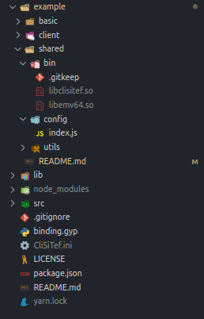

# Exemplos da biblioteca

Esta pasta contém exemplos de uso da biblioteca. No momento existem apenas duas aplicações console de exemplo. Futuramente pretendo colocar um exemplo utilizando em uma aplicação desktop utilizando **Electron**.

O primeiro exemplo é uma aplicação console que basicamente **instancia** o objeto do CliSiTef, chama o método de **configuração**, **verifica a presença** do PinPad e **escreve uma mensagem**. É um exemplo bem simples para demonstrar o uso básico da biblioteca.

Já o segundo é uma aplicação console interativa. Ele permite simular o funcionamento do SiTef pelo console, desde as funcionalidades mais simples, como configuração e verificação de presença do PinPad, até a simulação de uma função.

## Configuração

A configuração dos exemplos é a mesma que a da biblioteca. Portanto, adicione no **root do projeto** o arquivo `CliSiTef.ini`.

Em seguida, adicione as DLLs do SiTef na pasta **bin** (pasta vazia com apenas um arquivo `.gitkeep`), encontrada em **example/shared**. Esta pasta deve conter o arquivo `libclisitef.so` e a `libemv` de sua escolha.

Por fim, altere os parâmetros de configuração do arquivo `config/index.js`. O exemplo básico não necessita desses parâmetros, porém o cliente precisa para realizar a função. Segue exemplo de como deve ficar a estrutura:

